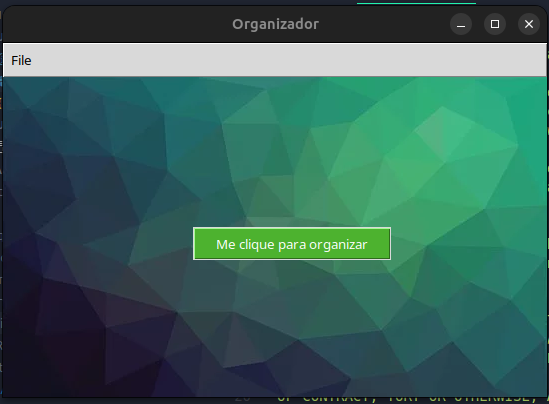
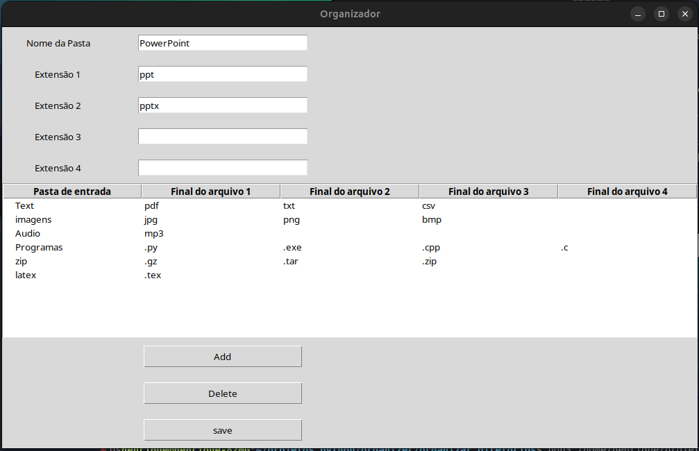
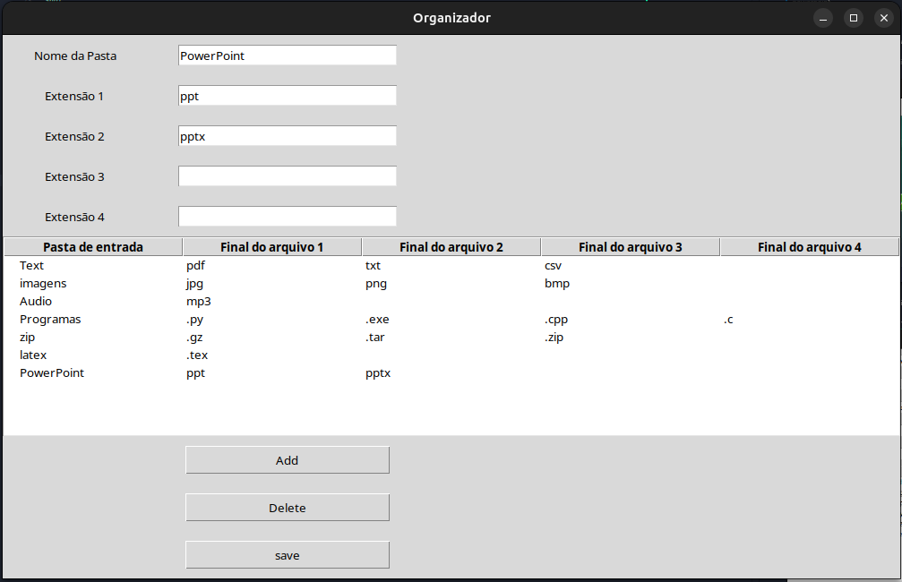
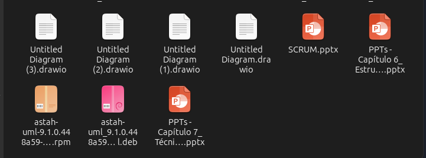
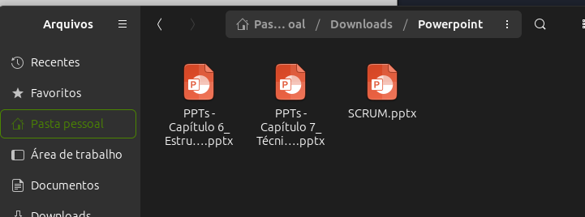

# Organizar diretorios

Aqui tem um organizador de diretorios que eu construi

Se quiser utilizalo baixe o arquivo e a pasta e posteriormente rode o ORG.exe

o ORG.exe deve estar dentro da pasta, ou compile vc mesmo. 

só rodar 

ele divide os arquivos em pastas separadas por

>imagens 

>documentos

>programas

>zip

>vídeos

>pdf

>powerpoint

>excel

O aplicativo consegue manter e organizar seus arquivos de maneira rápida a ideia é conseguir separar e aprender Tkinter.

Exemplos de funcionamento do aplicativo 

Ao clicar em File vc é capaz de selecionar a extensão e o nome da pasta em que deseja separar

No caso abaixo ao clicar em add ele vai gerar uma pasta Powerpoint em que o as extensões ppt e pptx serão adicionados a sua lista. 

Resultado ao clicar em add 

Ao clicar em save ele salva a configuração em um json chamado config.json

Caso queira alterar as configurações diretamente é só alterar o json config.json

Assim é fechar a pagina de configuração clicar em organizar e obter o resultado que segue abaixo

ANTERIOR 

DEPOIS 

MIT License. 
